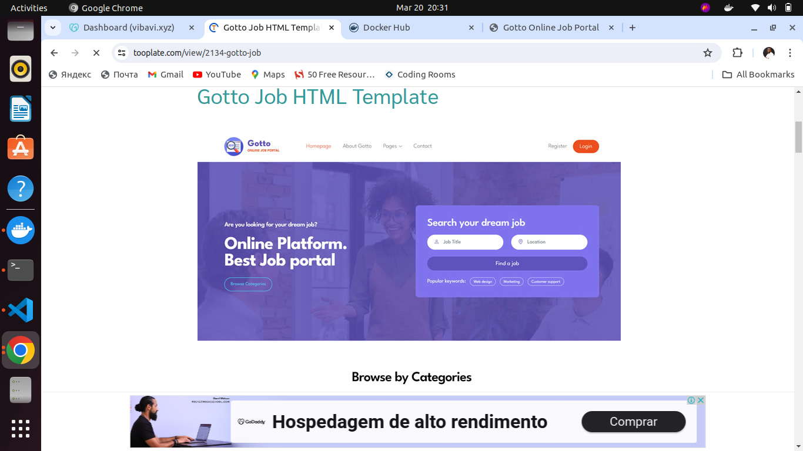
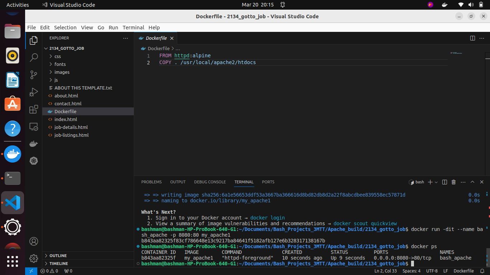
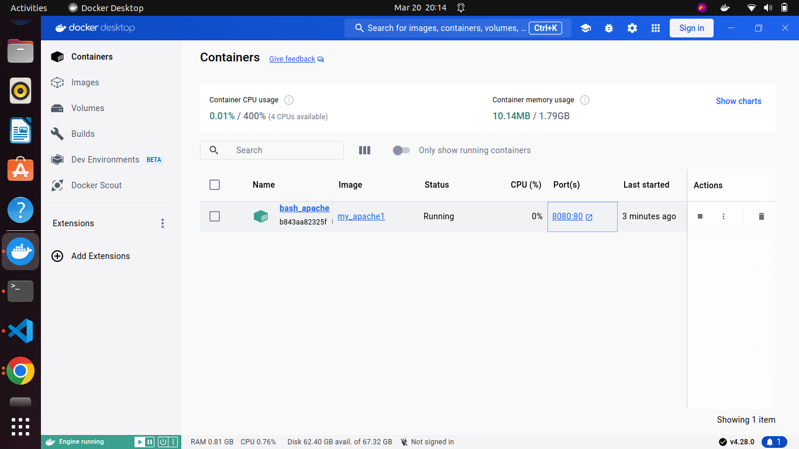
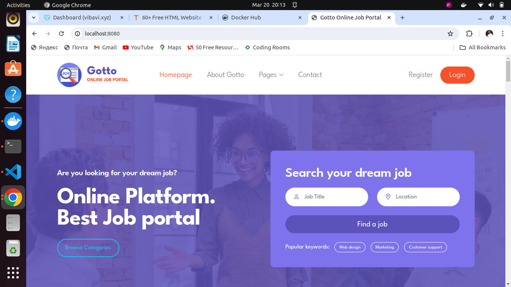

# Docker Assignments by Adesanya Bashiru
## Assignment 1
### Build
I pulled down an httpd alpine image and
I also downloaded a website template from tooplate  
I created a simple dockerfile with the downloaded website template
Using the dockerfile I built my own image with the image pulled down from the docker hub site
after which I did docker run with the built image 
Images below are my result 

### I downloaded the Gotto from tooplate

### I created a dockerfile and I built an image 

### My container from docker Desktop

### My clone Gotto website running locally on port 8080

