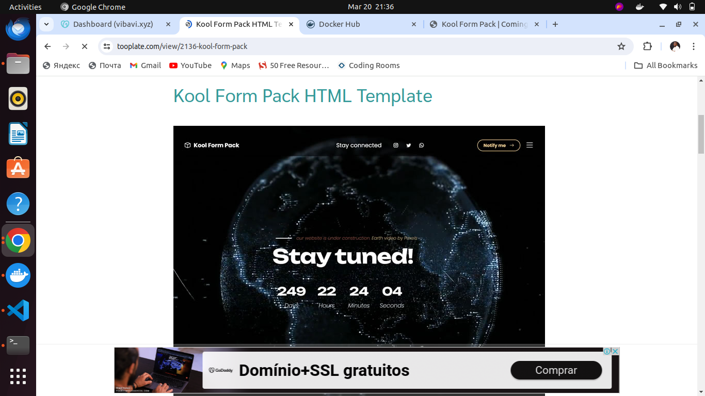
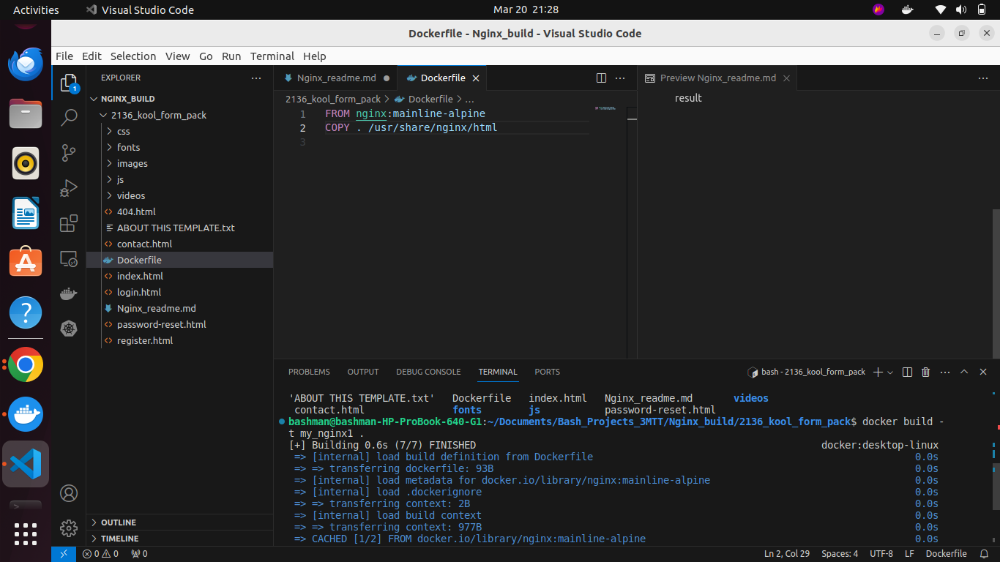
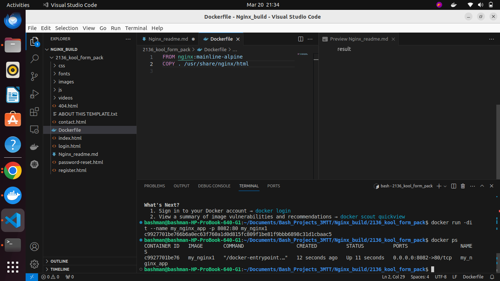
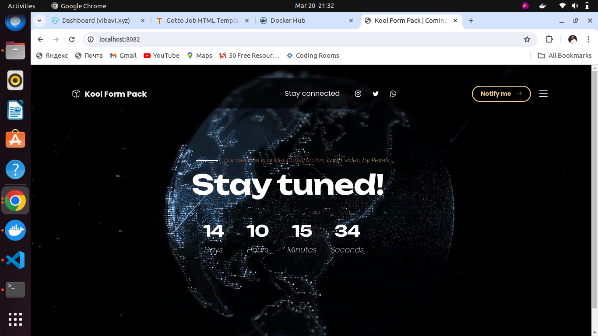

Docker Assignments by Adesanya Bashiru
## Assignment Nginx Image
### Build
I pulled down an Nginx alpine image and
I also downloaded a website template from tooplate  
I created a simple dockerfile with the downloaded website template
Using the dockerfile I built my own image with the image pulled down from the docker hub site
after which I did docker run with the built image 
Images below are my result 
### website from tooplate.com

### Dockerfile created

### Docker run 

### Website clone
