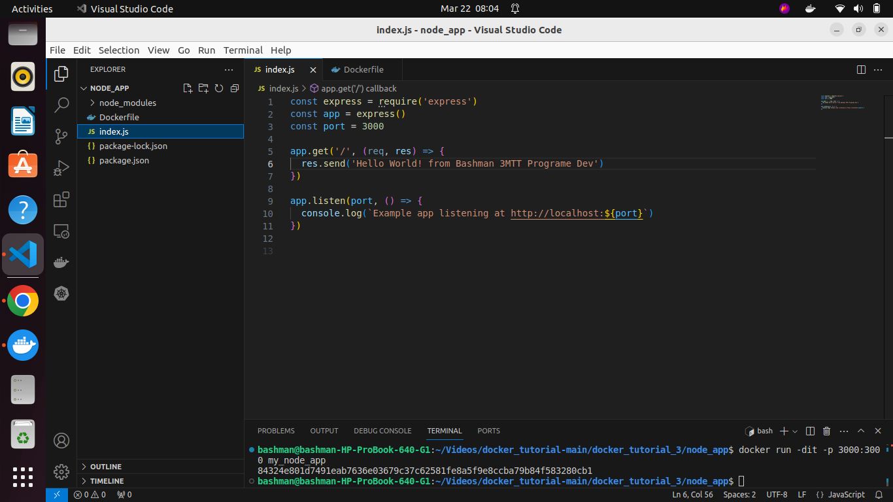
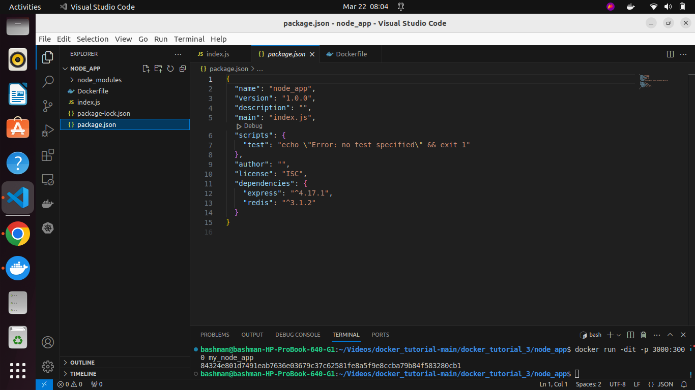
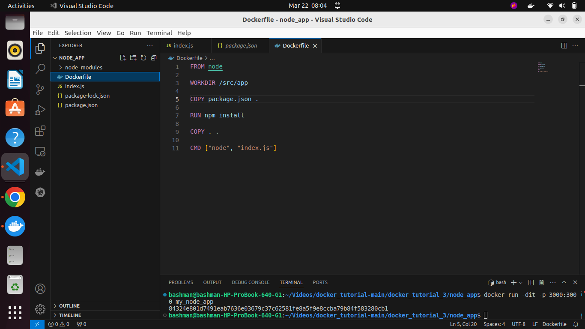
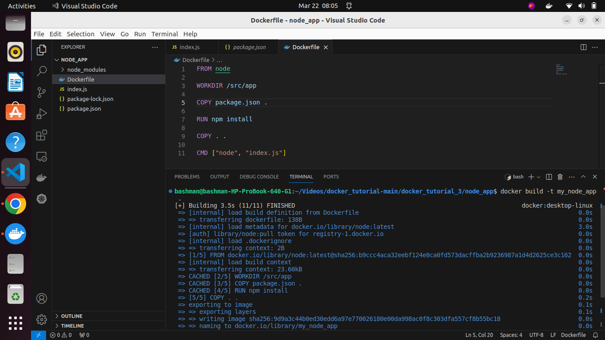
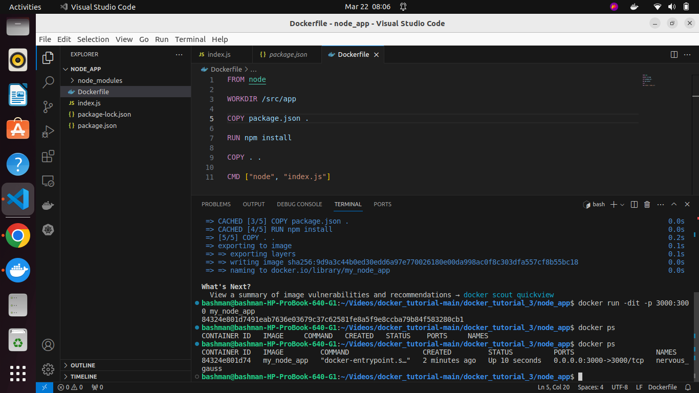
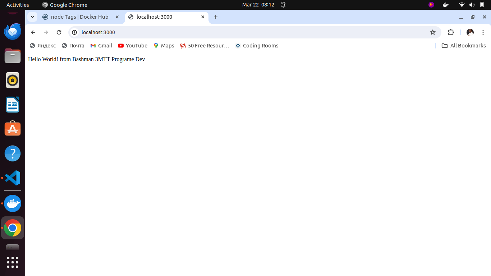

# This is a Node js app built using docker
### I created index.js file

### Also created the Package_json file

### after that then I created my docker file

### then I built my image with the docker file

### follow by docker run

### result 
