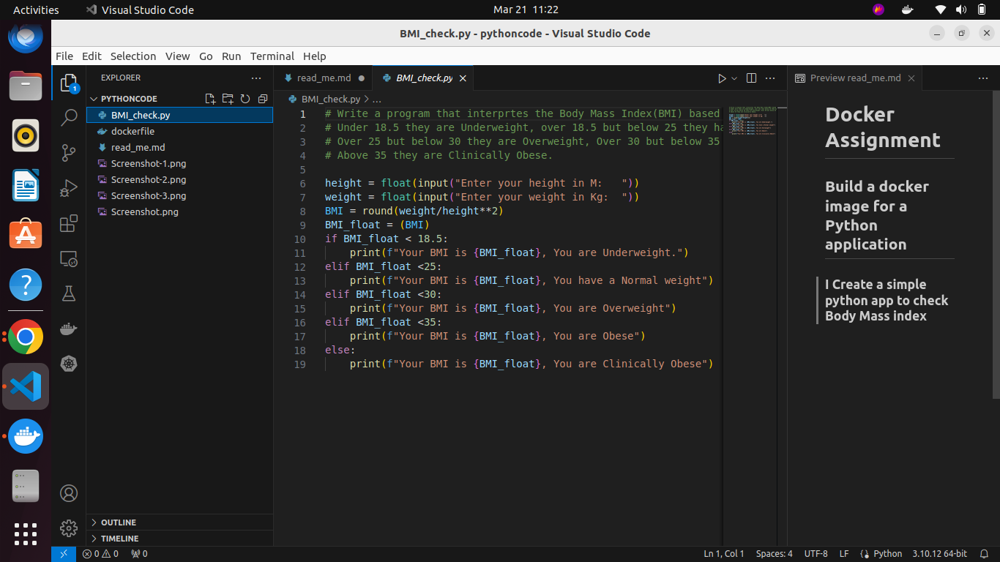
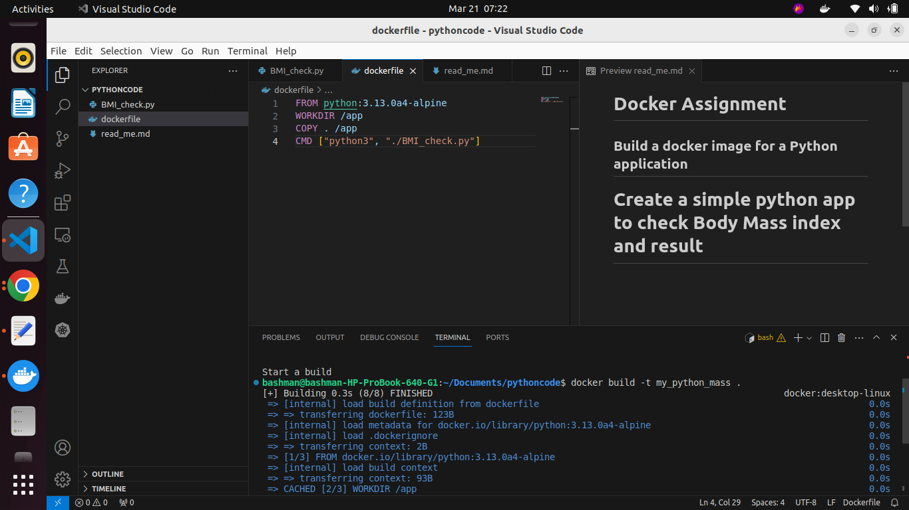
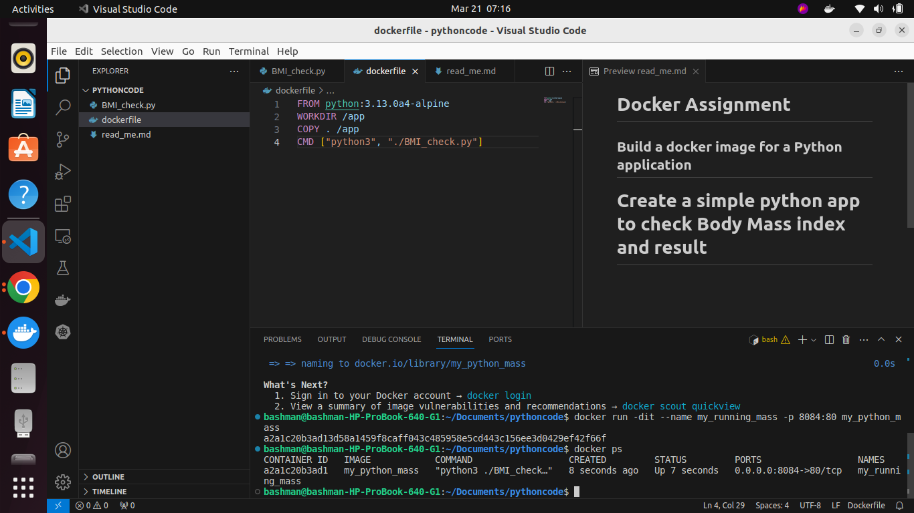
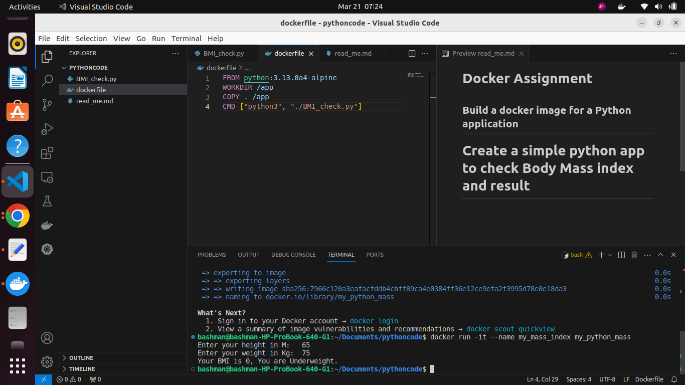

# Docker Assignment
## Build a docker image for a Python application
### I Create a simple python app to check Body Mass index

I pulled down python:3.13.0a4-alpine image then Create a python code to check body mass. create a docker file to build the image with it then run the image

### Python Code

### Dockerfile and build

### Docker run

### output after docker run
